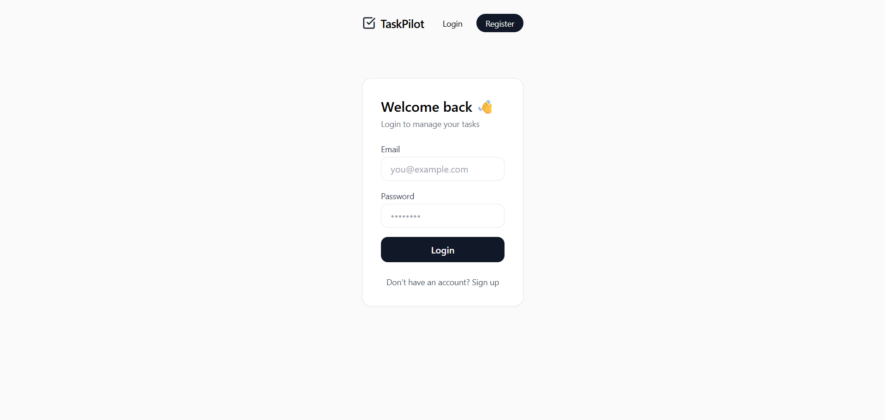
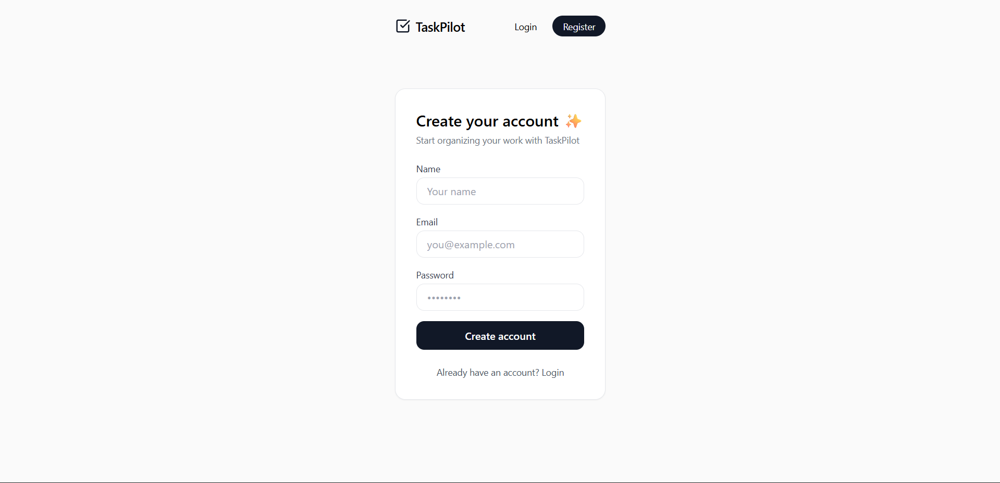

🚀 TaskPilot — Full-Stack MERN Task Manager

TaskPilot is a production-ready full-stack task management application built using the MERN stack.
It features user authentication, task CRUD operations, pagination, filtering, and a clean modern UI.

The application is fully deployed with a Dockerized backend, cloud database, and separate frontend hosting.

🌐 Live Demo

Frontend: https://taskpilot-mern.vercel.app

Backend (API): https://taskpilot-mern.onrender.com

Health Check: https://taskpilot-mern.onrender.com/health

✨ Features

🔐 User authentication (Register / Login) using JWT

🧾 Create, read, update, and delete tasks

📄 Pagination, filtering, and sorting of tasks

✏️ Inline task editing with save / cancel

🎨 Custom modern UI built with Tailwind CSS

🧠 Client-side form validation with inline errors

🐳 Dockerized backend for production readiness

☁️ Cloud-hosted MongoDB (MongoDB Atlas)

🛠️ Tech Stack
Frontend

-React (Vite)

-Tailwind CSS

-React Router

-Fetch API

Backend

-Node.js

-Express.js

-MongoDB + Mongoose

-JWT Authentication

-Docker

Deployment

Frontend: Vercel

Backend: Render (Docker Web Service)

Database: MongoDB Atlas

🏗️ Architecture Overview
Frontend (Vercel)
       |
       |  HTTPS
       v
Backend API (Render, Docker)
       |
       |  MongoDB URI
       v
MongoDB Atlas (Cloud)

🐳 Running Locally with Docker Compose
Prerequisites

Docker

Docker Compose

Clone the repository
git clone https://github.com/rajunarayan/taskpilot-mern.git
cd taskpilot-mern

Environment Variables

Create .env files:

backend/.env

PORT=5000
MONGO_URI=your_mongodb_atlas_uri
JWT_SECRET=your_secret_key

mern-task-frontend/.env

VITE_API_URL=http://backend:5000/api

Run the app
docker compose up --build

Access

Frontend: http://localhost:3000

Backend: http://localhost:5000/health

📸 Screenshots

-Login Page

-Signup Page

-Home Page

👤 Author

Raju Narayan
GitHub: https://github.com/rajunarayan

📄 License

This project is open-source and available under the MIT License.